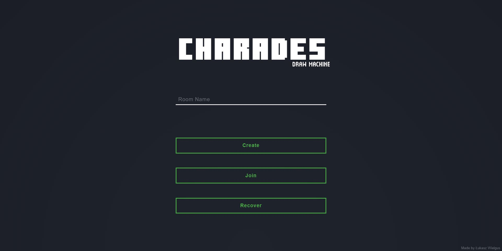
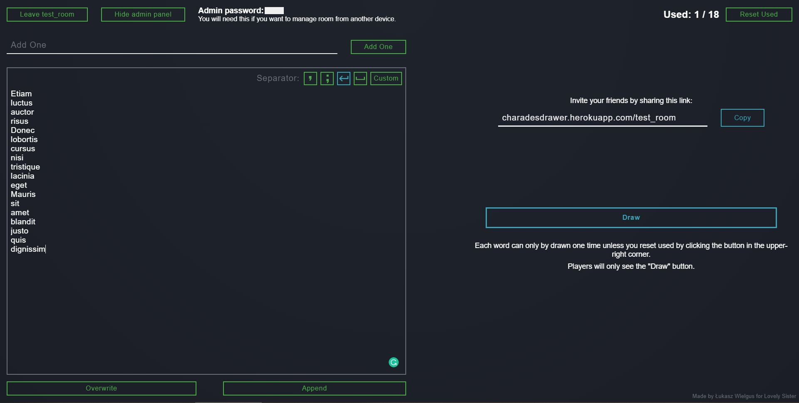

# Multiplayer Charades Game
## Full-stack app made with Vue.js, Express.js, and MongoDB

Live at: https://charadesdrawer.herokuapp.com/  (wait 10s for server cold start)

Join a demo room: https://charadesdrawer.herokuapp.com/test_room

The room owner can import or add words to the list. Players will then draw a random word which will be marked as used. Players won't see each other words so they can play charades together over the internet. 

The room state is stored in a MongoDB database and can be accessed or modified by the authenticated admin.

This app implements only common list management including batch imports, and multiplayer random word selection as it was meant to be MongoDB and CSS animations playground.

## Made by Łukasz Wielgus in 2020
